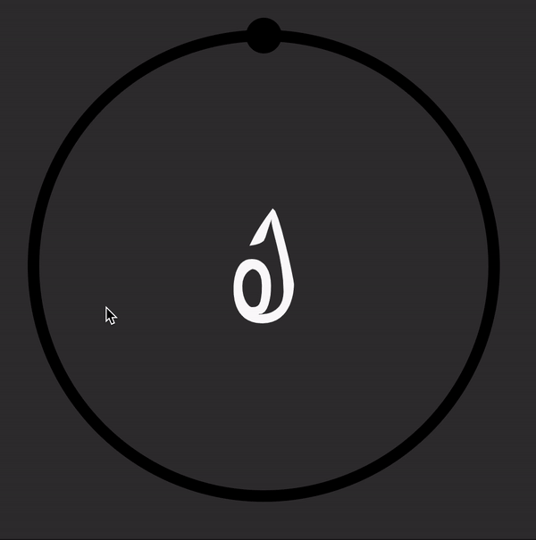

# JSPsych Color Task Demo Experiment

This is a demo jspsych experiment with a continuous report task for color memory (e.g. Zhang & Luck, 2008).

The entire demo experiment consists of two short tasks: 1) a "study" task where four images are presented and the participant should study the colors, followed by 2) a "recall" task where the participant uses a color wheel to select the color for each image. The whole demo takes less than a minute.

This is only a demo to provide the plugins to be customized for other experiments. The code would have to be adapted to fit other stimuli, task designs etc.

## SVG Plugin

The **jspsych-snap-keyboard-response.js** plugin is used in the first, "Study" portion of the demo. This plugin allows you to present SVG images, using the Snap.svg library. It's adapted from the jspsych-html-keyboard-response plugin.


## Continuous Report Plugin
 The **jspsych-continuous-report.js** plugin is used in the second, "Recall" portion of the demo. This particular experiment is coded with a color wheel, but the plugin could be changed to work for recall of orientation, spatial location, etc. This plugin also uses snap.svg in order to present the image and change the color.

As the cursor moves around the wheel, the central svg image changes color. Selecting with the cursor records the selected color.

The selected color and error are recorded (the correct color is given within the task.html script)




## Prerequisites

This code is made to demonstrate custom plugins for jspsych.

* [jspsych](https://www.jspsych.org/)  - Javascript library for running behavioral experiments in a web browser.
* [JQuery](https://jquery.com/) - Javascript library.
* [Snap.svg](http://snapsvg.io/) Javascript library for handling svgs, vector graphics (necessary for changing the image colors).
* [Psiturk](https://psiturk.org/) - (optional, not required, but this can work with psiturk if that's how you're getting the experiment on mTurk).


## Note on Getting Started
This project loads images (the svg files within the images folder), and if you are just running this from local files and not with https, you will get the error about cross origin requests. When it's running online, it'll work. But if you want to test locally and not run into this error, follow the instructions on [this](https://stackoverflow.com/questions/10752055/cross-origin-requests-are-only-supported-for-http-error-when-loading-a-local) page to open up a local web server to let your browser render local files.


As in, change directory to the experiment folder, and start a Python web server using either ``` python -m SimpleHTTPServer ``` or ```  python3 -m http.server ```. This will start a web server to host your entire directory listing at ```http://localhost:8000```. From there, run ***task.html***

## Contents


#### task.html
This is the main task. Run this to start the demo experiment (make note of the "note" above if you're running this locally). All other files are called within this one.


#### plugins/jspsych-continous-report.js
This is the custom plugin that runs the color wheel, recall task. It's called within task.html.

#### plugins/jspsych-snap-keyboard-response.js
This is the custom plugin that presents svg images during the study task of the demo. It's called within task.html.

#### colors.js
This is the array of colors to be used for the color wheel.

#### images/stim/1-4.svg
A couple demo svg files for this experiment.

#### css/custom.css
This is not a necessary file, but task.html loads this for some specifications for this particular demo.

## What is not included
This demo does not include any analysis scripts. The correct color and reported color are recorded, for you to be able to run analyses. I recommend the [MemToolbox](http://visionlab.github.io/MemToolbox/).
